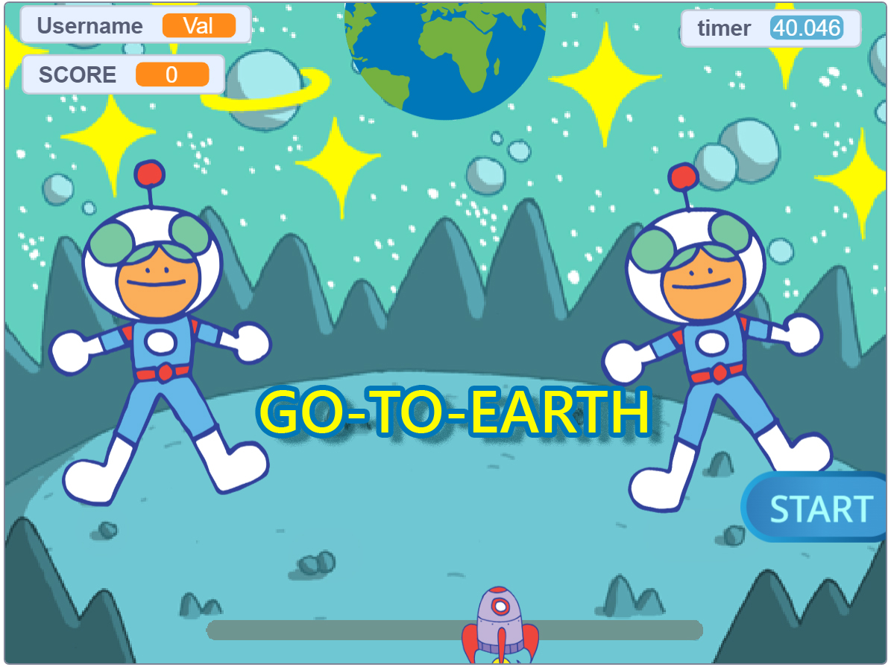
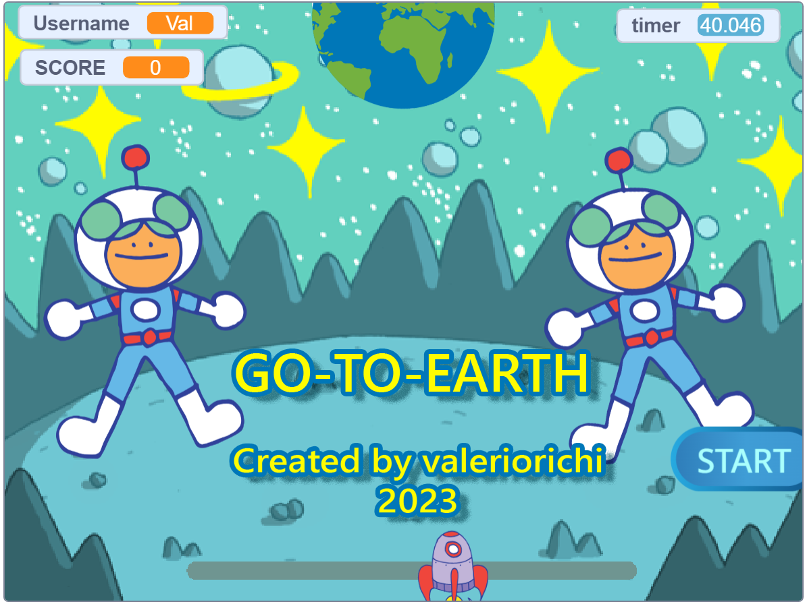
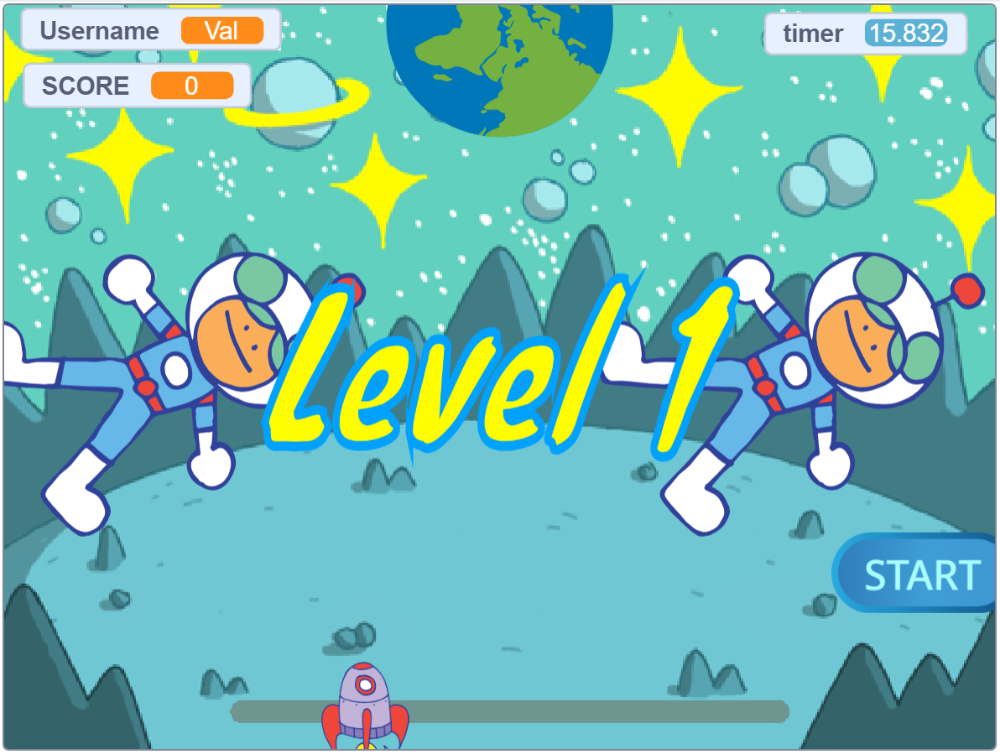
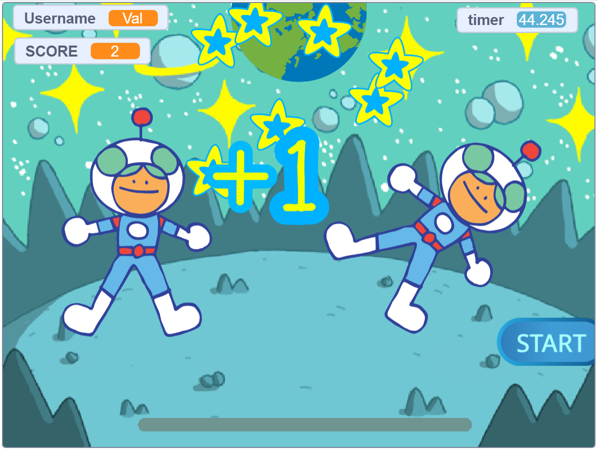
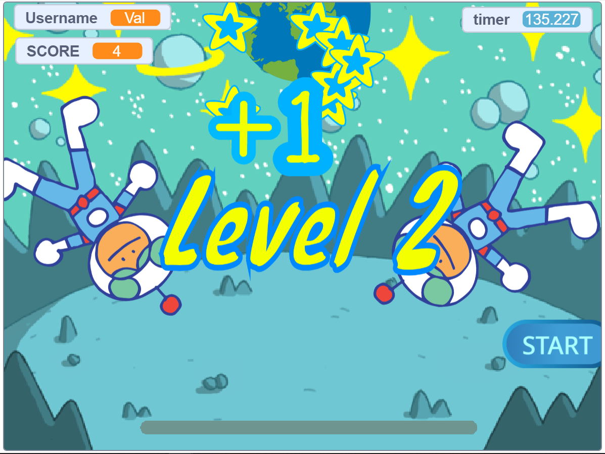
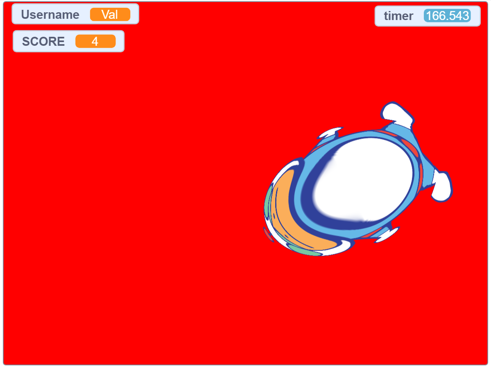
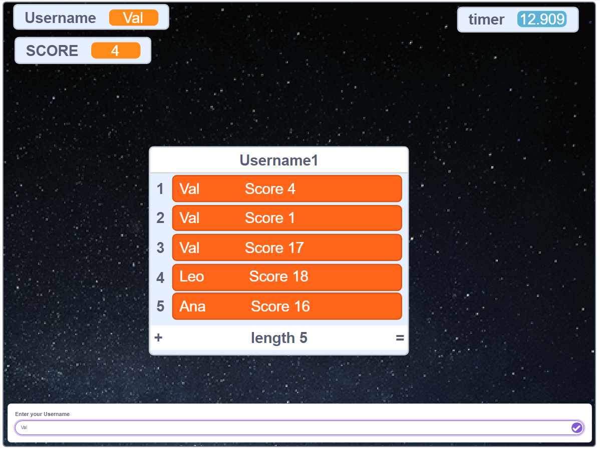

# Go-To-Earth Game

Welcome to the Go-To-Earth game! This game was created as a project for a coding school application. Its purpose is to test your skills in guiding rockets to Earth while avoiding collisions with aliens. The game is built using the Scratch platform.

# 

## Game Description

Upon launching the game, you will be prompted to enter your username. Once logged in, you can see your score and the rating table featuring the top 5 players. To begin the game, click the "START" button. A rocket will move along the launch position, and on the other side of the screen (at the top), you can see Earth. Two rotating aliens will be present between the rocket and Earth.

Your objective is to time the rocket's launch accurately by pressing the start button at the most convenient moment. The goal is to guide the rocket safely to Earth without any collisions with the aliens. Successfully guiding the rocket without any collisions will earn you +1 score. However, if you touch an alien or any part of their costume, a collision will occur. The game will display a red screen with an exploded alien that you collided with, and your score will be deducted accordingly.

The game features multiple levels of difficulty, with varying distances between the aliens, their movement speed, and the changing distance from the rocket to the aliens. As the levels progress, the difficulty increases, providing a challenge for players to achieve higher scores and reach the top of the rating table.

## How the Game Works

To create the game, the following logic, algorithms, design, and technical considerations were employed:

- **User Authentication**: The game starts by prompting the player to enter their username. This information is stored and associated with the player's score and ranking.

- **Game Mechanics**: The game utilizes Scratch's event-driven programming model. Clicking the green flag initiates the game, and clicking the start button launches the rocket. Collision detection is implemented to determine if the rocket touches the aliens.

- **Scoring System**: A scoring system keeps track of the player's performance. Each successful launch without collisions adds one point to the score. Collisions with aliens result in score deductions.

- **Rating Table**: The rating table displays the top 56 players and their scores. It allows players to see their ranking and encourages competition.

- **Visual Design**: The game incorporates visual elements such as rockets, aliens, and Earth to create an immersive experience. The rotating aliens and changing distances add complexity and excitement to the gameplay.

- **Difficulty Levels**: Multiple difficulty levels are implemented to provide increasing challenges for players. The distance between aliens, their movement speed, and the changing rocket-alien distance contribute to the varying difficulty levels.

## How to Play

To play the game, follow these steps:

1. Visit the game's [Scratch project page](https://scratch.mit.edu/projects/761656352/).
2. Click the green flag to start the game.
3. Enter your username when prompted.
4. Press the "START" button to launch the rocket.
5. Time your launch carefully to guide the rocket safely to Earth without touching the aliens.
6. Earn points for successful launches and avoid collisions to maintain a high score.
7. Challenge yourself by progressing through the difficulty levels to reach the top of the rating table.

Enjoy the game and good luck on your journey to Earth!

## Video Presentation

To get a visual preview of the game, you can watch the [Go-To-Earth Game Presentation](https://youtu.be/4hzW4m03NSU).

## Screenshots

Here are some screenshots of the game:

  
  
  

  
  
  

